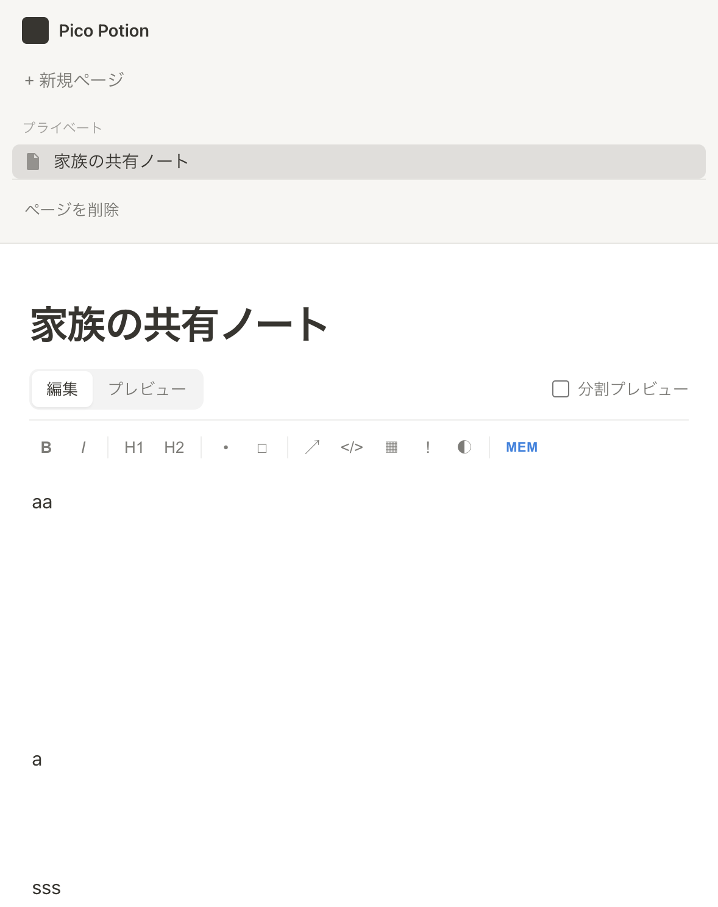

# Pico Potion (Rust)

家庭内LAN環境のRaspberry Pi上で動作する、極限まで軽量化されたセルフホスト型の共有ノートWebアプリケーションです。

## 背景と目的

家庭内LANで家族間の情報共有（メモ、買い物リスト、回覧板など）やシステム通知の集約を行うにあたり、既存のOSS（Mattermost、Affineなど）は高機能な反面、メモリ消費量が数百MB〜数GBに達し、シングルボードコンピュータであるRaspberry Piのリソースを大きく圧迫するという課題がありました。

本プロジェクトは、**「常時稼働中の消費メモリを5MB以下に抑える」**ことを目的に設計されています。機能を本質的なものに絞り込み、言語やアーキテクチャを最適化することで、ラズパイの負荷をほぼゼロにしつつ、実用的な共有ノート環境を提供します。

## 主な機能

- 複数ページの作成、切り替え、削除
- ページタイトルと本文の自動保存
- Markdown 編集とプレビュー
- 編集画面とプレビュー画面の切り替え
- 分割プレビュー
- Markdown ツールバー
- タスクチェックボックスのプレビュー上での切り替え
- `[[ページ名]]` による内部ページリンク
- `#タグ` の抽出表示
- 見出しからの目次生成
- コードブロックのコピー
- サーバプロセスの RSS 表示
- 旧 `micro_notion.db` から `pico_potion.db` への自動移行

## 画面

メモリ確認ボタンはツールバー右端の `MEM` です。



## 使用技術と省メモリ戦略

### バックエンド (Rust / Axum)

- **Rust言語の採用:** ガベージコレクション（GC）を持たないRustを採用し、待機時メモリを低く抑制。
- **Axum:** Rust製のWebフレームワークを採用。
- **Tokio current-thread runtime:** マルチスレッドランタイムではなく、軽量な単一スレッドランタイムで動作。
- **SQLite (rusqlite):** 外部データベースプロセス（PostgreSQL等）を立ち上げず、アプリプロセス内で単一ファイルとしてデータを管理。

DB 接続は `Arc<Mutex<Connection>>` で共有しています。DB ファイルは実行時のカレントディレクトリに `pico_potion.db` として作成されます。

### フロントエンド (Vanilla JS / HTML5)

- **ライブラリフリー:** React、Vue、Tailwind、Editor.jsなどの外部フレームワーク・エディタライブラリは使いません。
- **標準機能の活用:** HTML、CSS、Vanilla JavaScriptを中心に、Markdown編集、プレビュー、自動保存を実装。
- **バイナリ埋め込み:** フロントエンドは `src/main.rs` と `assets/marked.umd.min.js` からバイナリへ埋め込まれます。

## Markdown

通常の Markdown に加えて、次の記法を使えます。

| 入力 | 内容 |
| --- | --- |
| `# 見出し` | 見出し |
| `## 見出し` | 小見出し |
| `- 項目` | 箇条書き |
| `- [ ] タスク` | 未完了タスク |
| `- [x] タスク` | 完了タスク |
| `[[ページ名]]` | 同名ページへのリンク |
| `#タグ` | タグ |
| `==強調==` | ハイライト |
| `> [!NOTE]` | コールアウト |
| `@today` | 今日の日付 |
| `/1 見出し` | `# 見出し` に変換 |
| `/2 見出し` | `## 見出し` に変換 |
| `/b 項目` | `- 項目` に変換 |
| `/todo 項目` | `- [ ] 項目` に変換 |

本文が 512KB を超える場合、プレビューは抑止されます。

## 起動

### ビルド

```bash
cargo build --release
```

バイナリは `target/release/pico_potion` に出力されます。

macOS や Windows で作ったバイナリは、そのまま Raspberry Pi OS では動きません。Raspberry Pi 上でビルドするか、Linux aarch64 向けにクロスコンパイルしてください。

### 手動起動

```bash
./target/release/pico_potion
```

デフォルトポートは `8080` です。

```bash
./target/release/pico_potion --port 3000
./target/release/pico_potion -p 3000
./target/release/pico_potion 3000
PICO_POTION_PORT=3000 ./target/release/pico_potion
```

優先順位は CLI 引数、環境変数、デフォルト値の順です。

起動後、同じマシンでは次の URL で確認できます。

```text
http://localhost:8080
```

LAN 内の別端末からは次の形式でアクセスします。

```text
http://<Raspberry Pi の IP アドレス>:8080
```

サーバは `0.0.0.0` で待ち受けます。

### ヘルプ

```bash
./target/release/pico_potion --help
```

## データ

初回起動時に `pico_potion.db` が作成されます。

テーブルは `pages` です。

| カラム | 内容 |
| --- | --- |
| `id` | ページ ID |
| `title` | ページタイトル |
| `content` | Markdown 本文 |
| `created_at` | 作成日時の Unix 秒 |

古い `micro_notion.db` が同じディレクトリにあり、まだ `pico_potion.db` が存在しない場合は、起動時に `pico_potion.db` へリネームします。

## メモリ確認

画面上では、ツールバー右端の `MEM` を押すと、その時点の RSS が表示されます。自動更新はしません。対応 OS は Linux と macOS です。

Linux では次のように外部からも確認できます。

```bash
ps -eo pid,rss,comm | grep pico_potion
```

RSS は KB 単位です。

## Raspberry Pi で systemd 常駐

Raspberry Pi OS では systemd に登録して運用するのが安定します。

### Rust の準備

初回だけ実行します。

```bash
sudo apt update
sudo apt install -y build-essential pkg-config libssl-dev
curl --proto '=https' --tlsv1.2 -sSf https://sh.rustup.rs | sh
source ~/.cargo/env
```

### ビルドと配置

```bash
cargo build --release

sudo useradd --system --no-create-home --shell /usr/sbin/nologin pico-potion
sudo mkdir -p /opt/pico-potion
sudo cp target/release/pico_potion /opt/pico-potion/
sudo chown -R pico-potion:pico-potion /opt/pico-potion
sudo chmod 755 /opt/pico-potion/pico_potion
```

`WorkingDirectory` を固定することで、DB は `/opt/pico-potion/pico_potion.db` に作られます。

### ユニットファイル

`/etc/systemd/system/pico-potion.service` を作成します。

```ini
[Unit]
Description=Pico Potion
After=network-online.target
Wants=network-online.target

[Service]
Type=simple
User=pico-potion
Group=pico-potion
WorkingDirectory=/opt/pico-potion
ExecStart=/opt/pico-potion/pico_potion
Environment=PICO_POTION_PORT=8080

Restart=on-failure
RestartSec=5

NoNewPrivileges=true
ProtectSystem=strict
ProtectHome=true
ReadWritePaths=/opt/pico-potion

[Install]
WantedBy=multi-user.target
```

### 有効化

```bash
sudo systemctl daemon-reload
sudo systemctl enable pico-potion
sudo systemctl start pico-potion
sudo systemctl status pico-potion
```

### よく使うコマンド

| 操作 | コマンド |
| --- | --- |
| 状態確認 | `sudo systemctl status pico-potion` |
| 停止 | `sudo systemctl stop pico-potion` |
| 起動 | `sudo systemctl start pico-potion` |
| 再起動 | `sudo systemctl restart pico-potion` |
| 自動起動を無効化 | `sudo systemctl disable pico-potion` |
| ログを追う | `journalctl -u pico-potion -f` |
| 今日のログ | `journalctl -u pico-potion --since today` |

### 更新

新しいバイナリを配置して再起動します。

```bash
cargo build --release
sudo cp target/release/pico_potion /opt/pico-potion/
sudo chown pico-potion:pico-potion /opt/pico-potion/pico_potion
sudo systemctl restart pico-potion
```

DB を残したい場合は `/opt/pico-potion/pico_potion.db` を削除しないでください。

## 開発

テスト:

```bash
cargo test
```

リリースビルド:

```bash
cargo build --release
```

このプロジェクトでは、リリースプロファイルを小さなバイナリと低メモリ向けに調整しています。

```toml
[profile.release]
opt-level = "z"
lto = true
codegen-units = 1
panic = "abort"
```

この設定は運用時のメモリとバイナリサイズに関わるため、理由なく変更しないでください。

## 配布用 Zip

必要なファイルをまとめる場合は、`assets` と `docs` も含めます。

```bash
zip -r pico_potion.zip Cargo.toml Cargo.lock src/ assets/ docs/ README.md AGENTS.md
```

Windows PowerShell:

```powershell
Compress-Archive -Path Cargo.toml, Cargo.lock, src, assets, docs, README.md, AGENTS.md -DestinationPath pico_potion.zip
```
